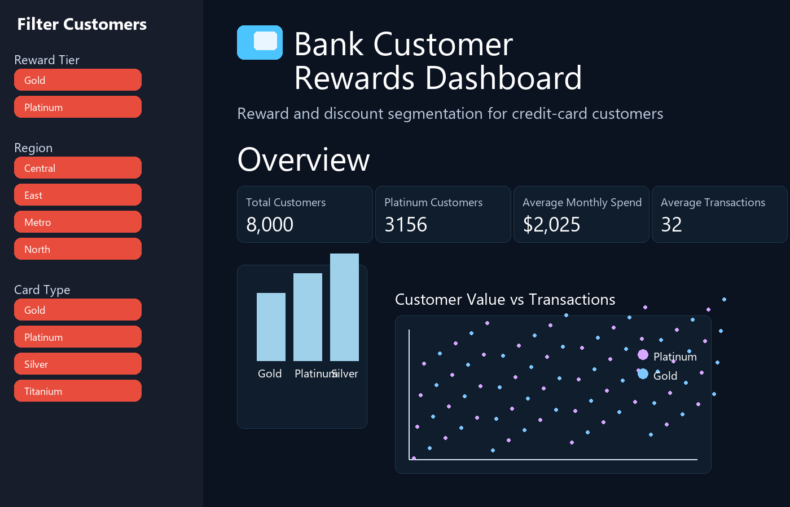

# Bank Customer Rewards Dashboard

A simple business dashboard that segments credit-card customers into reward tiers using K-Means clustering. It helps identify high-value customers for premium rewards and lower-value users for retention offers.

## Demo Screenshot



## Project Objective

This project identifies customers who should receive:

- Platinum rewards
- Gold-level incentives
- Silver re-engagement offers

It uses the most important reward-driving signals:

- Monthly spend
- Total transactions
- Offers redeemed

The model uses `random_state = 42` and selects the number of clusters using the elbow method, with a maximum of 3 clusters.

## Dataset

The synthetic dataset is generated through:

- [generate_credit_card_customer_dataset.py](generate_credit_card_customer_dataset.py)

Generated output files are saved in:

- [outputs/bank_credit_card_customers_8000.csv](outputs/bank_credit_card_customers_8000.csv)
- [outputs/reward_segmented_customers.csv](outputs/reward_segmented_customers.csv)

## App Structure

```text
.
├── app.py
├── generate_credit_card_customer_dataset.py
├── reward_customer_segmentation.py
├── requirements.txt
├── README.md
├── .gitignore
├── outputs/
│   ├── bank_credit_card_customers_8000.csv
│   ├── reward_segmented_customers.csv
│   ├── reward_elbow_curve.png
│   └── ...
├── images/
│   └── bank_customer_rewards_dashboard.png
└── __MACOSX/   # ignored by Git
```

## Run Locally

```bash
pip install -r requirements.txt
python generate_credit_card_customer_dataset.py
python reward_customer_segmentation.py
python -m streamlit run app.py
```

Then open the browser at:

```text
http://localhost:8501
```

## Reward Segmentation Logic

- Platinum: highest spend, highest transactions, strongest offer usage
- Gold: regular high-value customers
- Silver: lighter users needing basic incentives or re-engagement

## Tech Stack

- Python
- Pandas
- NumPy
- scikit-learn
- Matplotlib
- Plotly
- Streamlit

## License

This project is for educational and business demo purposes.
